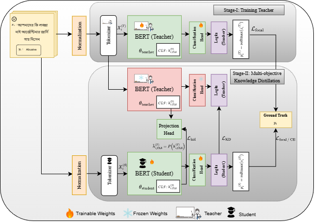
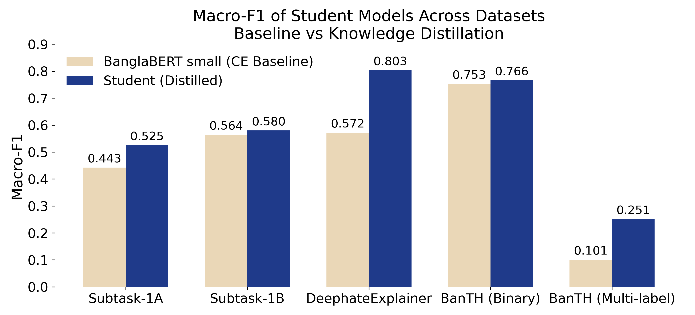

# Distilling Hate  
### Lightweight Transformer Models for Fine-Grained Bengali Hate Speech Detection

This repository contains the official implementation of **teacher-guided knowledge distillation** for efficient Bengali hate speech detection, as described in our paper:

> **Distilling Hate: Lightweight Transformer Models for Fine-Grained Bengali Hate Speech Detection**

We propose a **multi-objective knowledge distillation framework** that transfers both output-level and representation-level knowledge from a large BanglaBERT teacher to a compact BanglaBERT student, enabling strong performance under severe class imbalance while drastically reducing computational cost.

---

## 🔍 Overview

Hate speech detection in Bengali social media is challenged by:
- severe class imbalance,
- fine-grained hate categories,
- high computational cost of large transformer models.

Our approach addresses these challenges by combining:
- **Focal-loss–trained teacher models**
- **Logit-level knowledge distillation (KL divergence)**
- **Hidden-state alignment via CLS projection**
- **Optuna-based supervision loss and hyperparameter selection**

The resulting student model contains **only 13.7M parameters** and achieves competitive or superior **macro-F1** compared to much larger transformer baselines.

---

## 🧠 Architecture

  

**Training procedure**
1. Train a high-capacity **BanglaBERT Large** teacher using focal loss.
2. Freeze the teacher model.
3. Train a lightweight **BanglaBERT Small** student using:
   - supervised loss (cross-entropy or focal loss),
   - logit-level knowledge distillation,
   - hidden-state alignment via projected CLS representations.

---

## 📊 Key Results

### Macro-F1 Improvement via Knowledge Distillation

  

**Macro-F1 comparison of student models trained with cross-entropy (baseline) and with knowledge distillation across multiple datasets.**  
Knowledge distillation consistently improves or preserves student performance, with particularly large gains observed in challenging and fine-grained settings such as **BanTH multi-label classification**.

---

## 📁 Repository Structure

Each dataset has its **own folder**, containing:
- dataset files,
- teacher and student checkpoints,
- training and evaluation scripts.
.
├── subtask1A/
├── subtask1B/
├── deepHateExplainer/
├── banth/
├── figures/
└── README.md
.

---

## 🚀 Training and Evaluation

Each dataset is organized in a separate folder:
subtask1A/
subtask1B/
deepHateExplainer/
banth/

All datasets are also included inside their respective folders for convenience.

## 🔹 Train Knowledge Distillation (Teacher + Student)

To train the teacher with focal loss and perform knowledge distillation, navigate to the desired dataset folder and run:
python focal.py

This script:
trains the teacher model using focal loss,
freezes the trained teacher,
trains the student model using a combination of:
supervised loss,
logit-level knowledge distillation (KD),
hidden-state alignment.

## 🔹 Train Baseline Models

For standard (non-distilled) baseline training, run:
python model_baselines.py

For BanTH multi-label classification, use the cross-entropy baseline script:
python cross_entropy.py

Multi-label–specific counterparts of these scripts are provided inside the banth/ folder.

## 🔹 Evaluation

To evaluate trained models, run:
python eval.py

Evaluation reports the following metrics:
Accuracy
Macro-F1 (primary evaluation metric)
Weighted-F1

## 📚 Dataset Sources and Acknowledgments
🔹 BanTH Dataset (Transliterated Bangla)

HuggingFace:
https://huggingface.co/datasets/aplycaebous/BanTH

Original GitHub repository:
https://github.com/farhanishmam/BanTH

We acknowledge the authors for releasing this benchmark and associated resources.

🔹 DeepHateExplainer Dataset

Dataset available at:
https://github.com/rezacsedu/DeepHateExplainer

(located under the input/ folder)

Original repository:
https://github.com/rezacsedu/Bengali-Hate-Speech-Dataset

🔹 BanglaMultiHate (BLP-2025 Task-1)

Dataset repository:
https://github.com/AridHasan/blp25_task1

## ⚖️ Ethical Considerations

Hate speech detection systems carry significant societal risks, including false positives that may disproportionately affect marginalized groups.
We intentionally avoid naive data-level oversampling and instead rely on loss-aware training and knowledge distillation to better reflect real-world data distributions.
